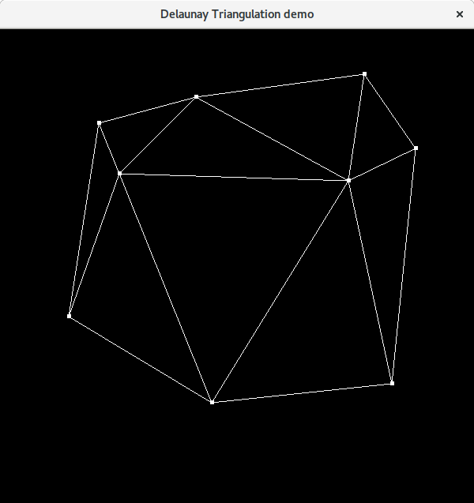

# C++11 Delaunay implementation

Implementation of the Bowyer-Watson algorithm, heavily inspired from: http://paulbourke.net/papers/triangulate.



## Requirements

* C++11 compliant compiler
* (OpenGL for the demo)

## How to use

* just include the ```delaunay.hpp``` header file
* do not use in production, more efficient implementation of Delaunay's triangulation can be found elsewhere.


## Example

*
    ```
  ...
  #include "delaunay.hpp"
  ...
  std::vector<delaunay::Point<float>> points;
  /* Initialize the points. */
  ...
  /* Triangulate. */
  const auto triangulation = delaunay::triangulate(point);
  ...
  /* Do domething with the edges or the triangles. */
  for (auto const& e : triangulation.edges) {
    ...
  }
  ....
  ```

* a working example can be found in the ```demo.cpp``` file, in addition the ```delaunay.hpp```header file should be self-explanatory.
